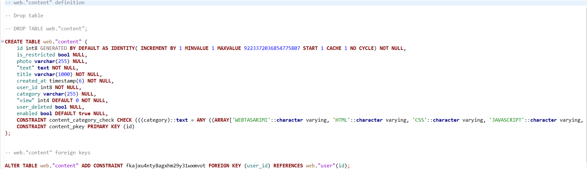
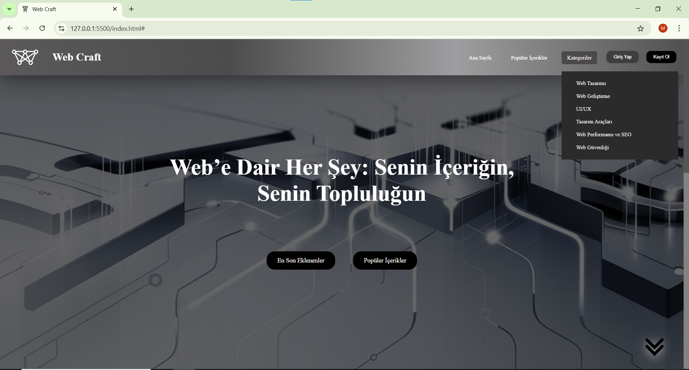
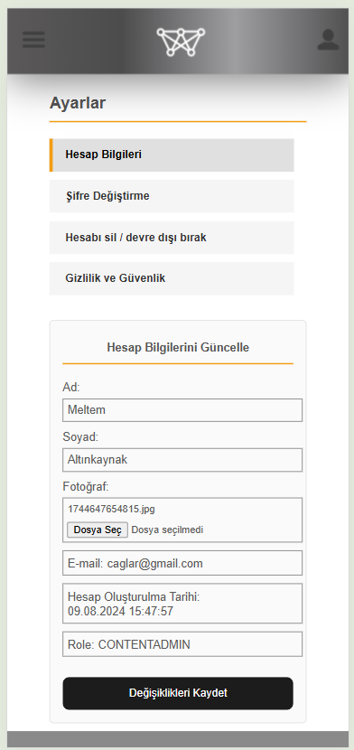

# Web Uygulaması - Spring Boot & PostgreSQL

Bu web uygulaması, **Spring Boot** ve **PostgreSQL** kullanılarak geliştirilmiştir. Kullanıcıların kayıt olabileceği, giriş yapabileceği ve içeriklerle etkileşime geçebileceği bir platform sunar. Proje, farklı kullanıcı rollerine sahip olup her bir rol için farklı erişim ve yetkilendirme seviyeleri sağlar.

## Kullanıcı Rolleri
- **User (Kullanıcı)**: Kayıt olma, giriş yapma, içeriklerle etkileşime geçme (beğenme, yorum yapma) ve kendi profilini ve aktivitelerini görüntüleme yetkisine sahiptir.
- **Content Admin (İçerik Yöneticisi)**: İçerik oluşturma, düzenleme ve silme işlemleri yapabilir.
- **Super Admin (Süper Admin)**: Kullanıcı yönetimi ve içerik görünürlüğü gibi ekstra yetkilere sahiptir.

## Ana Özellikler
- **Kullanıcı Kaydı ve Kimlik Doğrulama**: Kullanıcılar, JWT (JSON Web Token) ve çerezler aracılığıyla kayıt olabilir ve giriş yapabilir.
- **İçerik Erişim Kontrolü**:
  - **Misafir Kullanıcılar**: Sınırlı içeriklere erişebilir.
  - **Giriş Yapmış Kullanıcılar**: Tüm içeriklere erişebilir ve etkileşimde bulunabilir (beğenme, yorum yapma).
  - **Admin Rolleri**: İçerik Yöneticisi ve Süper Admin içerik paylaşabilir, düzenleyebilir ve silebilir.
- **Profil Yönetimi**: Kullanıcılar, profil bilgilerini güncelleyebilir ve kendi içeriklerini, aktivitelerini ve istatistiklerini görüntüleyebilir.
- **İçerik Kategorileri**: Kullanıcılar içerikleri kategorilere göre filtreleyebilir ve görüntüleyebilir.
- **Son Paylaşılan İçerikler**: Kullanıcılar en son paylaşılan içerikleri görüntüleyebilir.

## Kullanılan Teknolojiler
### Backend
- **Java  22.0.2**
- **Spring Boot  3.3.7**
- **Maven 3.9.9**
- **Spring Data JPA** 
- **Spring Security 3.4.2**
- **JWT (JSON Web Token) 0.11.5**
- **PostgreSQL**

### Frontend
- **HTML5, CSS3, JavaScript**: Temel web arayüzü ve etkileşimler için kullanılır.
  
## Bağımlılıklar

Bu proje **Spring Boot** tabanlı bir web uygulamasıdır ve yapılandırma yönetimi için **Maven** kullanılmıştır. 

- **Spring Boot Starter Web**  
  Web uygulamaları geliştirmek için gerekli tüm bileşenleri içerir (Tomcat, Jackson, vb.).

- **Spring Boot Starter Data JPA**  
  Veritabanı işlemleri için JPA desteği sağlar.

- **Spring Boot Starter Validation**  
  Veri doğrulama işlemleri için kullanılır (`@Valid`, `@NotNull`, vb.).

- **Spring Boot Starter Security** (`v3.4.2`)  
  Uygulama güvenliğini sağlamak için Spring Security bileşenlerini içerir.

- **PostgreSQL JDBC Driver**  
  PostgreSQL veritabanı ile bağlantı kurmak için kullanılır.

- **Lombok**  
  Boilerplate kodları azaltmak için (getter, setter, constructor, vb.) kullanılır.

- **JSON Web Token (JWT)**  
  Kullanıcı kimlik doğrulaması için aşağıdaki bağımlılıklar kullanılmıştır:
  - `jjwt-api`
  - `jjwt-impl`
  - `jjwt-jackson`

- **Spring Boot Starter Test**  
  Birim ve entegrasyon testleri için gerekli bağımlılıkları içerir.

##  Veritabanı - **PostgreSQL**

### Veritabanı Yapılandırması

Aşağıda `application.properties` dosyasında kullanılan temel yapılandırmalar yer almaktadır:
 - spring.datasource.url=jdbc:postgresql://localhost:5432/postgres
 - spring.jpa.properties.hibernate.default_schema=web
 - spring.datasource.username=postgres
 - spring.datasource.password= password

### ER Diyagramı 

### Tablo Yapısı
#### user:

#### content:

#### comment:

#### like:

# Arayüz Görselleri
## Misafir Kullanıcı
### Anasayfa

### Giriş

### Kayıt

### Kategoriler

### İçerik Detay

### Son Eklenenler

### Popüler İçerikler

## Giriş Yapmış Kullanıcı
### Anasayfa

### Profil

### Ayarlar

### İçerik Detay

### Toast Message

